# 목차  
[1. 게임 명 : 강해져서 돌아와라](#목차)  
[2. 컨셉](#컨셉)  
[3. 관련 이미지와 동영상](#관련-이미지와-동영상)  
[4. 대표 이미지](#대표-이미지)  
[5. 컨셉과 대표 이미지 기반 작품묘사](#컨셉과-대표-이미지-기반-작품묘사)  
[6. "강해져서 돌아와라" 구성 요소](#강해져서-돌아와라-구성-요소)  
[7. 게임시스템 디자인](#게임시스템-디자인)  
* [a. 게임 오브젝트 분해](#1-게임-오브젝트-분해)  
* [b. 파라미터 뽑아 보기](#2-파라미터-뽑아-보기)  
* [c. 행동 뽑아 보기](#3-행동-뽑아-보기)  
* [d. 상태 뽑아 보기](#4-상태-뽑아-보기)  
* [e. 플레이어 캐릭터 속성](#5-플레이어-캐릭터-속성)  
* [f. 게임 규칙](#6-게임-규칙)  
* [g. 게임에서 사용될 공식](#7-게임에서-사용될-공식)  

[8. 개발 요구사항 and 흐름도](#개발-요구사항-and-흐름도)  
* [a. 요구사항](#1-요구사항)  
* [b. 시간별 흐름도 flowchart](#2-시간별-흐름도-flowchart)  
* [c. 키보드 이벤트에 대한 흐름도](#3-키보드-이벤트에-대한-흐름도)  
* [d. 용어정리](4-용어정리)  

[9. 스토리보드](#스트리보드)  
[10. 개발작업 일정](#개발작업-일정)  

   

# [컨셉]
## 메인컨셉 : 부흥
- 플레이어가 몬스터에게 얻은 아이템을 이용하여  마을을 부흥시킨다는 스토리. 
- 플레이가 게임을 진행하여 마을이 부흥하는 것을 느낄 수 있도록 한다. 처음에 보이지 않던 NPC나 구조물 등이 보이도록 구연.
- 장르 : 2D, 로그라이트, 플렛포머
### 서브컨셉 1 : 아기자기
- 남녀노소 누구나 게임을 즐길 수 있도록 하기 위해.
- 너무 현실적이거나 잔인한 요소 제거하고, 동화와 비슷한 분위기를 조성하여 게임 플레이에 거부감이 없도록 구연.
### 서브컨셉 2 : 선택
- 우리가 살아갈 때도 끊임없이 선택을 한다고 생각한다. 더불어 선택에 따라 결과가 달라진다고 생각한다. 
- 플레이어에게 게임 안에서 선택할 수 있는 부분을 넓히고, 그 결과에 따라 게임이 달라지도록 구연.
### 서브컨셉 3 : 다양성
- 플레이어가 게임을 쉽게 지루해하지 않고, 한 번만 하고 게임을 종료하는 것이 아니라 몇번이든 계속하게 하기 위해서 게임 안의 요소들을 다양하게 만들어야 한다고 생각한다.
- 맵과 아이템, BGM 등을 한 가지만 아니라 여러 가지를 구연.
### 서브컨셉 4 : 성장
- 자신의 캐릭터가 성장할 때 그 캐릭터에 대한 애정이 높아지고 캐릭터에게 몰입할 수 생각한다. 
- 캐릭터가 죽어서 가지고 있는 아이템은 없어져도 캐릭터가 가지고 있는 능력치는 그대로 하여 경험을 쌓아 성장한다고 느끼게 하도록 구연.
### 서브컨셉 5 : 단순화
- 게임이 복잡하면 게임에 적응하기 어렵고 게임을 이해한 특정 플레이어만 게임을 누리게 된다.
- 누구나 쉽게 게임에 적응 할 수 있도록 하기 위해 UI적 요소들을 단순화하여 구연.

  
# [관련 이미지 & 동영상]
## - 이미지  
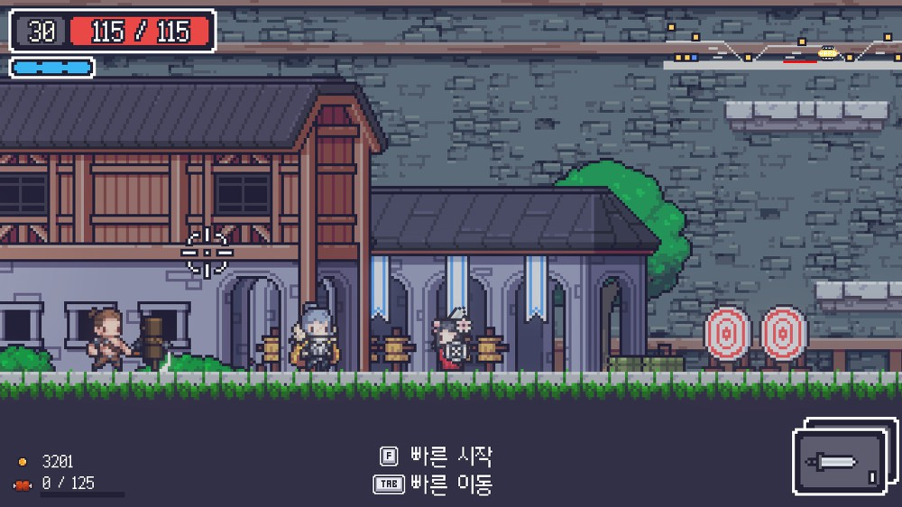
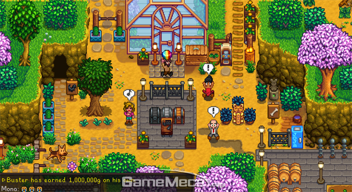

## - 동영상

[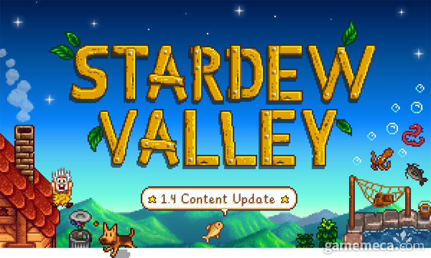](https://www.youtube.com/watch?v=DS8UqsdJ2Fo&list=PLKAxWhb-naUXbdwsUkp6Oe7SVyhCxzpCT)

  
# [대표 이미지]
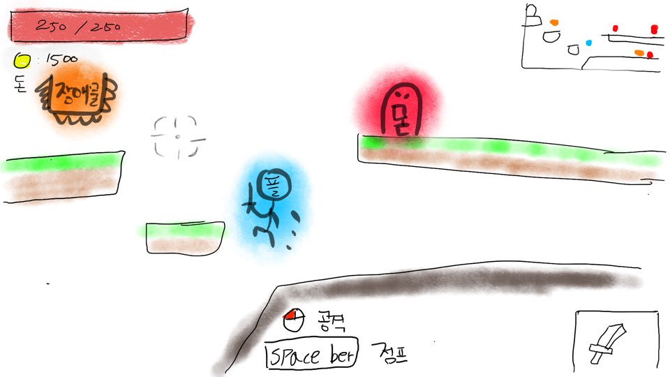

  
# [컨셉 & 대표이미지 기반 작품묘사]

> ### 대표이미지 기반 : 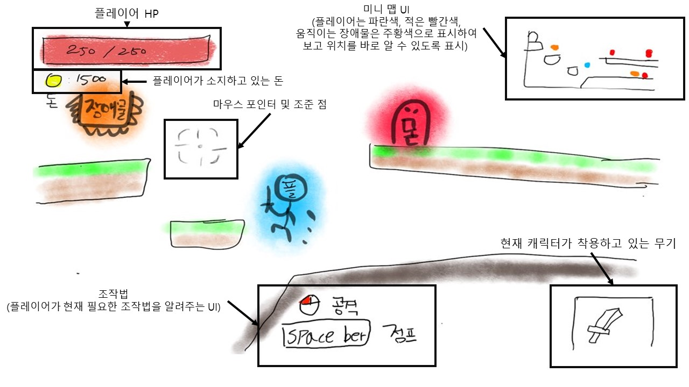

  
# ["강해져서 돌아와라" 구성 요소]
 

## 1. 메커니즘

[도전 과제]
1. 자신을 공격하는 몬스터를 죽여라
2. 장애물을 피하여 보물상자가 있는 방까지 도달하라.

[재미 요소]
1. 몬스터를 죽이면 돈 혹은 무기를 떨군다.
2. 장애물을 이용해 적을 죽일 수 있다.

 

## 2. 이야기

지금 현 상황에 대한 묘사는 플레이어가 돈과 보물을 얻기 위해 던전에 들어가 있는 모습니다. 위쪽으로 올라가기 위해 플레이어는 스페이스바를 이용하여 점프를 하고 있는 상황입니다. 

 

## 3. 미적요소

[디자인] 
현 상황에서 플레이어의 색과 몬스터의 색, 장애물의 색을 다르게하고 같은 요소끼리는 색을 동일하게 하여 색만 봐도 어떤 요소인지 알 수 있습니다.

[음향] 
현 상황에서 나오고 있는 음향은 플레이어가 점프할 때 나오는 효과음과 몬스터가 움직이는 소리, 던전이라는 배경을 생각하여 조금 음침하고 잔잔한 BGM이 흘러 나오고 있습니다.
	
 

## 4. 기술  
[개발환경] 
- Windows 10 Pro
- Unity (2020.1.3f1)
- Adobe Photoshop CC  
 

# [게임시스템 디자인]

## 1. 게임 오브젝트 분해  

|연번|오브젝트 이름|오브젝트 이미지|  
|:---:|:---:|:---:|  
| 1 |주인공(플레이어)||
| 2 |기본 몬스터(슬라임)||
| 3 |특수 속성 몬스터|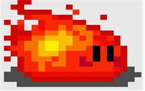|
| 4 |문지기(중간 몬스터)|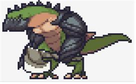|
| 5 |최종 보스||
| 6 |가시 장애물|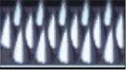|
| 7 |떨어지는 장애물|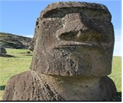|
| 8 |곡갱이|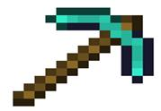|
| 9 |삽|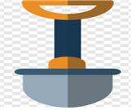|
| 10 |던전|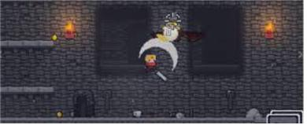|
| 11 |마을|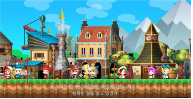|
| 12 |무기 상점|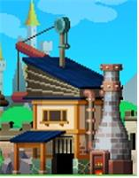|
| 13 |훈련소|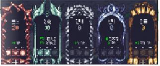|

    

## 2. 파라미터 뽑아 보기  
   

### 1) 오브젝트 이름 : 주인공(플레이어)  

|속성|속성 값|설명|비고|
|:---:|:---:|:---:|:---:|
|이동 속도|5|주인공이 이동하는 속도|신속 업그레이드 시 1 = 1|
|HP|100|몬스터에게 맞고 버틸 수 있는 값|인내 업그레이드 시 1 = 50|
|데미지|10|몬스터에게 주는 데미지|힘 업그레이드 시 1 = 10|
|기본 신속|1|이동 속도와 관련된 스테이터스||
|기본 힘|1|데미지와 관련된 스테이터스||
|기본 인내|1|HP와 관련된 스테이터스||
|기본 탐욕|1|돈 획득량와 관련된 스테이터스||

   

### 2) 오브젝트 이름 : 기본 몬스터 (슬라임)  

|속성|속성 값|설명|비고|
|:---:|:---:|:---:|:---:|
|이동 속도|3|맵을 이동하는 속도||
|HP|50|맞고 버틸 수 있는 값||
|데미지|30|플레이어에게 주는 데미지||

   

### 3) 오브젝트 이름 : 특수 속성 몬스터 (불)  

|속성|속성 값|설명|비고|
|:---:|:---:|:---:|:---:|
|이동 속도|5|맵을 이동하는 속도||
|HP|100|맞고 버틸 수 있는 값||
|데미지|50|플레이어에게 주는 데미지||
|특수 속성|불|몬스터가 가지고 있는 속성|맵에 있는 오브젝트 먹을 시 변경|

   

### 4) 오브젝트 이름 : 문지기(중간보스)  

|속성|속성 값|설명|비고|
|:---:|:---:|:---:|:---:|
|이동 속도|7|맵을 이동하는 속도||
|HP|300|맞고 버틸 수 있는 값||
|데미지|70|플레이어에게 주는 데미지||

   

### 5) 오브젝트 이름 : 최종보스

|속성|속성 값|설명|비고|
|:---:|:---:|:---:|:---:|
|이동 속도|15|맵을 이동하는 속도||
|HP|400|맞고 버틸 수 있는 값||
|데미지|100|플레이어에게 주는 데미지||

   

### 6) 오브젝트 이름 : 가시 장애물  

|속성|속성 값|설명|비고|
|:---:|:---:|:---:|:---:|
|데미지|50|플레이어에게 주는 데미지||

 

### 7) 오브젝트 이름 : 떨어지는 장애물  

|속성|속성 값|설명|비고|
|:---:|:---:|:---:|:---:|
|데미지|100|플레이어에게 주는 데미지||
|이동 속도|5|떨어지는 속도||

   

### 8) 오브젝트 이름 : 곡생이  

|속성|속성 값|설명|비고|
|:---:|:---:|:---:|:---:|
|데미지|50|플레이어에게 주는 데미지||
|공격 속도|1|다시 공격을 하는데 까지 걸리는 시간||

   

### 9) 오브젝트 이름 : 삽  

|속성|속성 값|설명|비고|
|:---:|:---:|:---:|:---:|
|데미지|100|플레이어에게 주는 데미지||
|공격 속도|5|다시 공격을 하는데 까지 걸리는 시간||

   

### 10) 오브젝트 이름 : 마을  

|속성|속성 값|설명|비고|
|:---:|:---:|:---:|:---:|
|무기 상점|20,000|무기 상점을 건설하는 비용||
|훈련소|10,000|훈련소를 건설하는 비용||
|방어구 상점|20,000|방어구 상점을 건설하는 비용||

   

### 11) 오브젝트 이름 : 무기 상점  

|속성|속성 값|설명|비고|
|:---:|:---:|:---:|:---:|
|곡생이|5,000|곡생이의 가격||
|삽|15,000|삽의 가격||

   

### 12) 오브젝트 이름 : 훈련소  

|속성|속성 값|설명|비고|
|:---:|:---:|:---:|:---:|
|신속|500|신속 스테이터스를 올리는 비용|한번 올릴 때 마다 가격이 올라감 2 = 2,500|
|힘|500|힘 스테이터스를 올리는 비용|한번 올릴 때 마다 가격이 올라감 2 = 2,500|
|인내|500|인내 스테이터스를 올리는 비용|한번 올릴 때 마다 가격이 올라감 2 = 2,500|
|탐욕|500|탐욕 스테이터스를 올리는 비용|한번 올릴 때 마다 가격이 올라감 2 = 2,500|

    

## 3. 행동 뽑아 보기  
 

### 1) 오브젝트 이름 : 주인공(플레이어)  

|속성|설명|
|:---:|:---:|
|이동|다른 곳으로 이동하기 위한 행동|
|공격|몬스터를 죽이기 위한 행동|
|점프|높은 곳으로 올라가거나 공격을 피하기 위한 행동|
|아파하다|몬스터에게 닿았을 때 하는 행동|

   

### 2) 오브젝트 이름 : 기본 몬스터 (슬라임)  

|속성|설명|
|:---:|:---:|
|이동|다른 곳으로 이동하기 위한 행동|
|점프|이동 중에 높은 곳을 만났을 때 올라가기 위한 행동|
|아파하다|플레이어의 공격이 닿았을 때 하는 행동|

   

### 3) 오브젝트 이름 : 특수 속성 몬스터 (불)  

|속성|설명|
|:---:|:---:|
|이동|다른 곳으로 이동하기 위한 행동|
|공격|플레이어를 죽이기 위한 행동|
|점프|이동 중에 높은 곳을 만났을 때 올라가기 위한 행동|
|아파하다|플레이어 닿았을 때 하는 행동|

   

### 4) 오브젝트 이름 : 문지기(중간보스)  

|속성|설명|
|:---:|:---:|
|이동|다른 곳으로 이동하기 위한 행동|
|공격|플레이어를 죽이기 위한 행동|
|점프|이동 중에 높은 곳을 만났을 때 올라가기 위한 행동|
|아파하다|플레이어 닿았을 때 하는 행동|
   

### 5) 오브젝트 이름 : 최종보스  

|속성|설명|
|:---:|:---:|
|이동|다른 곳으로 이동하기 위한 행동|
|공격|플레이어를 죽이기 위한 행동|
|점프|이동 중에 높은 곳을 만났을 때 올라가기 위한 행동|
|아파하다|플레이어 닿았을 때 하는 행동|

   

### 6) 오브젝트 이름 : 떨어지는 장애물  

|속성|설명|
|:---:|:---:|
|이동|위에서 아래로 떨어져 데미지를 주기 위한 행동|

    

## 4. 상태 뽑아 보기  
 

### 1) 오브젝트 이름 : 주인공(플레이어)  

|현 상태|전의 상태|전의 조건|
|:---:|:---:|:---:|
|기본|이동|플레이어가 이동키를 늘렀을 때|
|기본|공격|플레이어가 공격키를 눌렀을 때|
|기본|점프|플레이어가 점프키를 눌렀을 때|
|기본|아픔|몬스터에게 닿았을 때|

   

### 2) 오브젝트 이름 : 기본 몬스터 (슬라임)  

|현 상태|전의 상태|전의 조건|
|:---:|:---:|:---:|
|기본|이동|일정거리르 이동할 때|
|기본|점프|점프할 구간을 만났을 때|
|기본|아픔|플레이어의 공격이 닿았을 때|

   

### 3) 오브젝트 이름 : 특수 속성 몬스터 (불)

|현 상태|전의 상태|전의 조건|
|:---:|:---:|:---:|
|기본|이동|일정거리르 이동할 때|
|기본|공격|플레이어를 발견하고 일정거리에 왔을 때|
|기본|점프|점프할 구간을 만났을 때|
|기본|아픔|플레이어의 공격이 닿았을 때|

   

### 4) 오브젝트 이름 : 문지기(중간보스)  

|현 상태|전의 상태|전의 조건|
|:---:|:---:|:---:|
|기본|이동|일정거리르 이동할 때|
|기본|공격|플레이어를 발견하고 일정거리에 왔을 때|
|기본|점프|점프할 구간을 만났을 때|
|기본|아픔|플레이어의 공격이 닿았을 때|

   

### 5) 오브젝트 이름 : 최종보스  

|현 상태|전의 상태|전의 조건|
|:---:|:---:|:---:|
|기본|이동|일정거리르 이동할 때|
|기본|공격|플레이어를 발견하고 일정거리에 왔을 때|
|기본|점프|점프할 구간을 만났을 때|
|기본|아픔|플레이어의 공격이 닿았을 때|

   

### 6) 오브젝트 이름 : 떨어지는 장애물  

|현 상태|전의 상태|전의 조건|
|:---:|:---:|:---:|
|기본|이동|플레이어가 일정거리에 왔을 때|

    

## 5. 플레이어 캐릭터 속성  
 

|속성|영문 명칭|설명|비고|
|:---:|:---:|:---:|:---:|
|이동 속도|Speed|주인공이 이동하는 속도||
|HP|HealthPoint|몬스터에게 맞고 버틸 수 있는 값||
|데미지|Damage|몬스터에게 주는 데미지||
|기본 신속|AGI|이동 속도와 관련된 스테이터스. 최대 올릴 수 있는 수치는 10.||
|기본 힘|STR|데미지와 관련된 스테이터스. 최대 올릴 수 있는 수치는 10.||
|기본 인내|DEF|HP와 관련된 스테이터스. 최대 올릴 수 있는 수치는 10.||
|기본 탐욕|LUK|돈 획득량와 관련된 스테이터스. 최대 올릴 수 있는 수치는 10.||

    

## 6. 게임 규칙  
 

### 1) 핵심 규칙  
- 던전에서 돈을 모아 건물을 산다. 최종적으로 마을 회관을 사면 클리어.  
- 던전에서 최종 보스를 죽이면 클리어.  
### 2) 보조 규칙  
- 플레이어가 죽으면 가지고 있는 아이템은 없어진다.  
- 몬스터가 죽으면 일정 확률로 돈 혹은 아이템을 떨어트린다.  
- 던전을 들어갈 때마다 몬스터의 위치, 장애물의 위치, 맵의 크기가 바뀐다.  
- 마을 회관은 건물을 3개 이상 건설했을 시 건설할 수 있다.  
    

## 7. 게임에서 사용될 공식  
  

# [개발 요구사항 and 흐름도]  
 

## 1. 요구사항  
### ‘강해져서 돌아와라’의 요구사항(1년)  
- 시작화면, 스토리화면, 마을화면, 던전화면 총 4개의 화면이 있다.  
- ‘시작화면’에는 위에 타이틀이 있고, 중간 오른쪽에 ‘게임 시작’ 버튼이 있다.  
- ‘시작화면’ 중간에는 ‘조작법’과 ‘캐릭터’가 있다.  
	- 조작은 키보드 ‘W, A, S, D'로 이동, ‘F’키로 상호작용, ‘I’키로 인벤토리 확인, 마우스 ‘좌 클릭’으로 공격과 선택을 할 수 있다.  
	- 조작법대로 키를 누르게 되면 캐릭터가 움직인다.  
	- 단 ‘시작 화면’에서는 ‘F’와 ‘I’는 활성화 되지 않는다.  
- ‘게임 시작’ 버튼을 클릭 시 저장 데이터가 없다면 ‘스토리 화면’으로 이동한다.  
	- ‘스토리 화면’에서는 스토리를 보여준다.  
	- ‘스토리 화면’에서는 하단 오른쪽에 ‘스킵’ 버튼이 있다.  
	- ‘스킵’ 버튼 클리 시 ‘마을 화면’으로 이동한다.  
	- 스토리를 다 보여주면 자동으로 ‘마을 화면’으로 이동한다.  
- 기존에 저장데이터가 있다면 바로 ‘마을 화면’으로 이동한다.  
- ‘마을 화면’에서는 상단 왼쪽에 플레이어의 ‘HP’ 가 표시되고, 바로 아래에 현재 가지고 있는 ‘골드’의 개수가 표시된다.  
- ‘마을 화면’에서 플레이어 캐릭터가 NPC에게 다가갔을 때 NPC 머리 위에 ‘F’ 라는 표시가 나타난다.  
- ‘F’를 눌렀을 때 NPC와 ‘상호작용’ 할 수 있다.  
- ‘마을 화면’에서 ‘던전 입구’를 통해 ‘던전 화면’으로 이동한다.  
	- '던전 화면'은 4가지 맵 중 1가지 맵을 랜덤으로 이동하게 된다.  
- ‘던전 화면’에서는 상단 왼쪽에 플레이어의 ‘HP’ 가 표시되고, 바로 아래에 현재 가지고 있는 ‘골드’의 개수가 표시된다.  
- ‘던전 화면’에서 하단 오른쪽에는 ‘저장’ 버튼이 있다.  
- ‘던전 화면’의 하단 중앙에는 조작법이 표시되고, 하단 오른쪽에는 현재 착용하고 있는 무기가 표시된다.  
- ‘던전 화면’에서 플레이어 캐릭터의 ‘HP’가 0이 됐을 경우 '죽었습니다'라는 문구를 중앙에 표시 하며 ‘마을 화면’으로 이동한다.  
- ‘골드’는 기본 몬스터 ‘100 ~ 500’ 사이, 특수 몬스터 ‘300 ~ 700’ 사이, 문지기(중간 보스) ‘500 ~ 1000’ 사이를 떨어트린다.  
- 특수 몬스터는 맵에 있는 속성 오브젝트를 '먹어' 변화한다.
 

### ‘강해져서 돌아와라’의 요구사항(6주)  
- 시작화면, 마을화면, 던전화면 총 3개의 화면이 있다.  
- ‘시작화면’에는 위에 타이틀이 있고, 중간 오른쪽에 ‘게임 시작’ 버튼이 있다.  
- ‘시작화면’ 중간에는 ‘조작법’과 ‘캐릭터’가 있다.  
	- 조작은 키보드 ‘W, A, S, D'로 이동, ‘F’키로 상호작용, ‘I’키로 인벤토리 확인, 마우스 ‘좌 클릭’으로 공격과 선택을 할 수 있다.  
	- 조작법대로 키를 누르게 되면 캐릭터가 움직인다.  
	- 단 ‘시작 화면’에서는 ‘F’와 ‘I’는 활성화 되지 않는다.  
- ‘게임 시작’ 버튼을 클릭 시 ‘마을 화면’으로 이동한다.  
- ‘마을 화면’에서는 상단 왼쪽에 플레이어의 ‘HP’ 가 표시되고, 바로 아래에 현재 가지고 있는 ‘골드’의 개수가 표시된다.  
- ‘마을 화면’에서 플레이어 캐릭터가 NPC에게 다가갔을 때 NPC 머리 위에 ‘F’ 라는 표시가 나타난다.  
- ‘F’를 눌렀을 때 NPC와 ‘상호작용’ 할 수 있다.  
- ‘마을 화면’에서 ‘던전 입구’를 통해 ‘던전 화면’으로 이동한다.  
	- '던전 화면'은 4가지 맵 중 1가지 맵을 랜덤으로 이동하게 된다.  
- ‘던전 화면’에서는 상단 왼쪽에 플레이어의 ‘HP’ 가 표시되고, 바로 아래에 현재 가지고 있는 ‘골드’의 개수가 표시된다.  
- ‘던전 화면’에서 하단 오른쪽에는 ‘저장’ 버튼이 있다.  
- ‘던전 화면’의 하단 중앙에는 조작법이 표시되고, 하단 오른쪽에는 현재 착용하고 있는 무기가 표시된다.  
- ‘던전 화면’에서 플레이어 캐릭터의 ‘HP’가 0이 됐을 경우 '죽었습니다'라는 문구를 중앙에 표시 하며 ‘마을 화면’으로 이동한다.  
- ‘골드’는 기본 몬스터 ‘100 ~ 500’ 사이, 문지기(중간 보스) ‘500 ~ 1000’ 사이를 떨어트린다.  
 

## 2. 시간별 흐름도 flowchart  
 

## 3. 키보드 이벤트에 대한 흐름도  
 

## 4. 용어정리  
 

# [스토리보드]  
 

# [개발작업 일정]  
 
